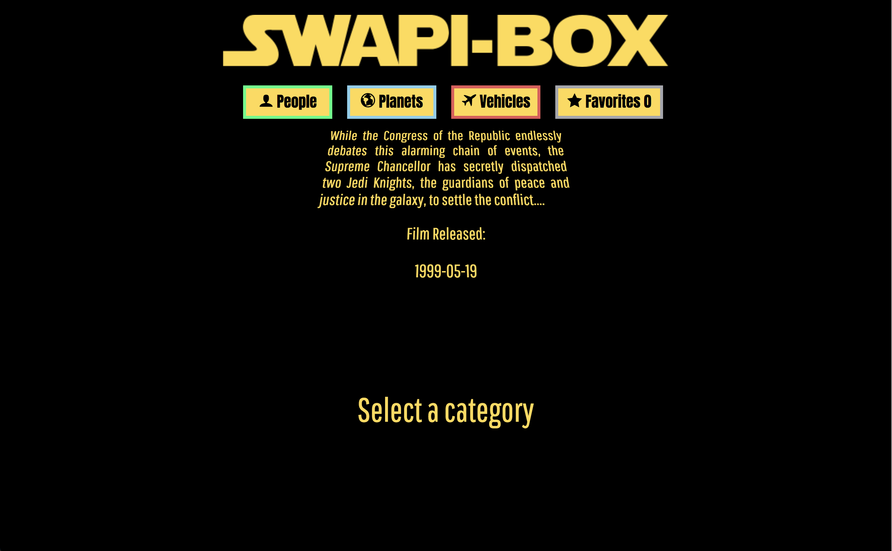
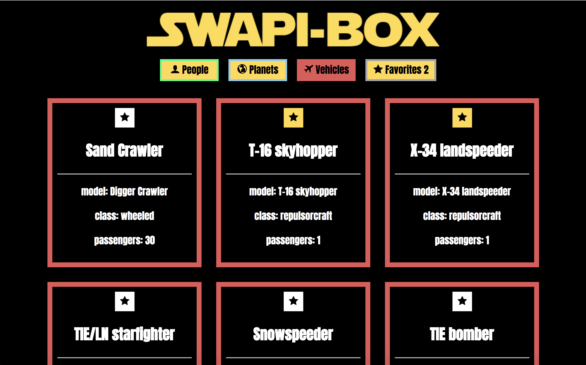

# SWAPI-box

SWAPI-box is a react app that allows users to view Star Wars data from the Star Wars API https://swapi.co/documentation. There are four buttons that allow the user to browse through people, planets, vehicles and favorites. Users can add cards to favorites by clicking on the favorite button.

React, JavaScript, and ES7 Async were used for this project.

## Project Goals

1. Practicing and getting familiar with React components.

2. Writing clean, well refactored code using ES6 syntax.

3. Making informed design decisions to create a user-friendly application.

4. Keeping state based components to a minimum and leveraging more functional components.

5. Using a modular architecture for application file structure.

6. Thinking deeply about React Lifecycle Methods.

7. Using propTypes for every component receiving props.

## Individual Project

Aldo Mercado

## Set Up

Clone this repository

Run `npm install` from the root directory

Run `npm start` and visit localhost:3000 in your browser

## Screenshot

